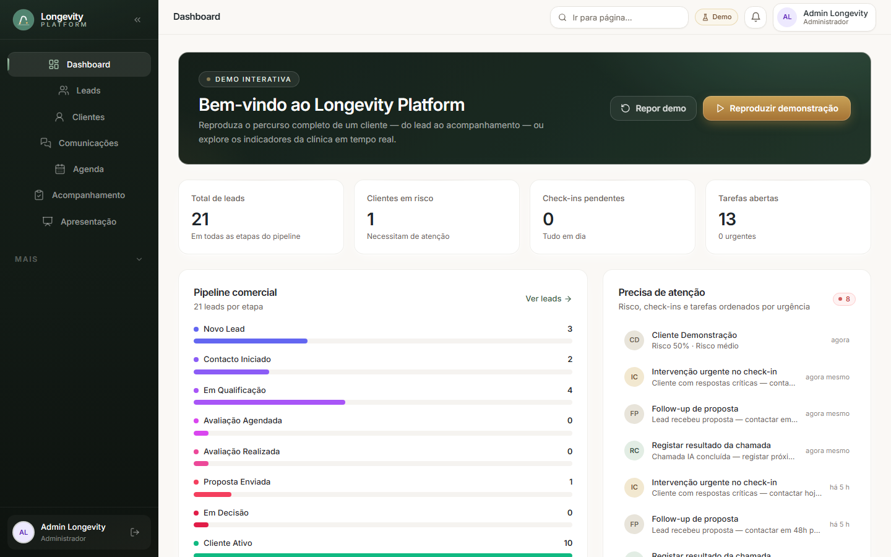
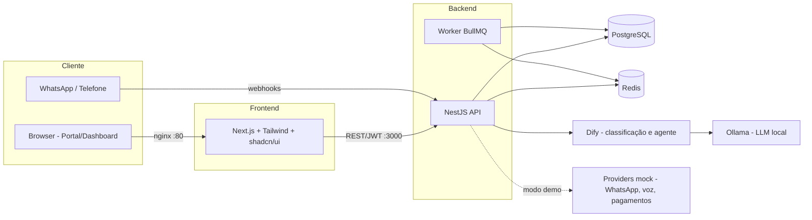

# Longevity Platform

Plataforma de saúde e longevidade com IA integrada — CRM, automações de WhatsApp, assistente de voz, agentes de LLM e acompanhamento contínuo de clientes, da captação à retenção.

> Projeto de portefólio full-stack com Inteligência Artificial aplicada a um caso de negócio real: subscrição mensal com check-ins de saúde semanais, monitorização de risco e portal do cliente.

[](https://github.com/alexfamaslb2020-ux/longevity-platform/actions/workflows/ci.yml)




## Proposta de valor

Uma clínica de longevidade precisa de manter clientes subscritos mês após mês. Isso exige contacto frequente, atenção personalizada e intervenção rápida quando algo indica risco de desistência. Esta plataforma junta num só produto o CRM do negócio com IA que acompanha cada cliente semanalmente — por WhatsApp e telefone — e sinaliza automaticamente quem precisa de atenção.

## O problema

- Gestão de clientes dispersa por folhas de cálculo e mensagens avulsas;
- Check-ins de saúde semanais feitos à mão, com falhas e sem histórico;
- Nenhuma visibilidade de risco de desistência antes de o cliente cancelar;
- Equipa pequena com pouco tempo para atendimento e follow-up.

## A solução em demo (percurso de 14 passos)

O dashboard inclui o botão **"Reproduzir demonstração"**: um journey de 14 passos que reproduz o ciclo de vida completo de um cliente num clique — formulário do site, qualificação com score, atendimento por WhatsApp com IA, chamada de voz com transcrição, avaliação, conversão, subscrição Premium, check-in com alerta, risco de desistência e portal do cliente. O botão **"Repor demo"** limpa os dados criados.

As estimativas de negócio (MRR, potencial de pipeline, receita em risco, horas poupadas) são calculadas a partir dos dados de demonstração e apresentadas na página de apresentação (`/presentation`).

**Assistente IA (RAG)**: a página `/ia` permite semear a base de conhecimento (5 documentos sintéticos), conversar com o agente (preços, funcionamento, agendamento…), ver as fontes citadas e o score de avaliação de cada resposta. Fluxo completo de function calling: pedir "quero marcar uma consulta" → o agente propõe horários → confirmas → o `Appointment` é criado e auditado.

## Funcionalidades

| Área | Funcionalidades |
|---|---|
| **CRM** | Pipeline de captação (lead → qualificação → proposta → cliente), tarefas, notas, histórico de conversas e chamadas |
| **IA (agentes LLM)** | Atendimento automático por agente de linguagem (Dify + Ollama local), classificação de intenções, respostas em português com regras de negócio |
| **RAG (pgvector)** | Assistente com pesquisa semântica PostgreSQL (`vector` + HNSW), fontes citadas em cada resposta, recusa honesta sem contexto, e avaliação determinística (6 critérios) |
| **Function calling** | Agendamento real via ferramenta `schedule_appointment`: proposta de horários → confirmação humana → `Appointment` com auditoria |
| **WhatsApp** | Check-ins semanais de saúde (escala 1–5 + dificuldades), respostas automáticas via webhook, lembretes e recomendações |
| **Voz (IA)** | Assistente telefónico "Sofia" com transcrição automática associada ao registo do cliente |
| **Retenção** | Risco de desistência calculado automaticamente, alertas em tempo real, tarefas de intervenção |
| **Portal do cliente** | Check-ins, consultas, evolução, subscrição e avisos — vista dedicada ao cliente |
| **Modo demonstração** | Journey de 14 passos que reproduz o ciclo de vida completo de um cliente num clique |

## Arquitetura



- **Multi-tenant**: todos os dados são isolados por `organizationId` (validado por testes e2e de isolamento entre organizações);
- **Filas**: automações, check-ins e alertas são processados assincronamente via BullMQ + Redis, sem bloquear a API;
- **Tolerância a falhas**: se o Dify/Ollama não responde, o agente responde por regras locais pré-definidas;
- **RAG reprodutível**: embeddings locais determinísticos (384 dims, zero dependências externas) permitem pesquisas semânticas e avaliações 100% reproduzíveis em CI; provider `ollama` opcional;
- **Sem alucinações**: sem contexto recuperado acima do limiar, o agente recusa-se honestamente — verificado por critério de avaliação `honest_refusal`.

## Stack

- **Backend**: NestJS (Node.js/TypeScript) + Prisma + PostgreSQL + Redis + BullMQ
- **Frontend**: Next.js + Tailwind CSS + shadcn/ui
- **IA**: Dify (orquestração de agentes) + Ollama (LLM local — privacidade dos dados) + retry com tolerância a falhas
- **Infra**: Docker Compose para a demo (5 serviços: web, api, postgres, redis, nginx), Turborepo; filas BullMQ embutidas na API; Dify/Ollama opcionais e externos ao stack
- **Integrações**: webhooks de WhatsApp, voz simulada com transcrição, providers mock em modo demo

## Testes e CI

O pipeline GitHub Actions (`ci.yml`) corre em cada push: lint + typecheck + build, testes unitários e testes de integração/e2e contra PostgreSQL e Redis reais (serviços Docker).

| Suite | Testes | Estado |
|---|---|---|
| Unitários — API (NestJS services) | 21 | ✅ |
| Unitários — Web (API client) | 12 | ✅ |
| Integração e e2e — auth, health, multi-tenant, journey | 35 | ✅ |
| Lint / Typecheck / Build | — | ✅ 0 warnings |

Os testes e2e correm serializados (`maxWorkers: 1`) para evitar deadlocks entre suites que partilham a mesma base de dados, e os clientes Redis são fechados corretamente no shutdown (sem handles abertos).

## Quick Start — demo em minutos

Pré-requisitos: **Docker Desktop** (com Compose v2) em execução. Não é preciso instalar Node.js — toda a demo corre em containers.

Abra um terminal PowerShell na raiz do projeto:

```powershell
Copy-Item .env.demo.example .env.demo
.\start-demo.bat
```

O script faz tudo: verifica o Docker, constrói as imagens (a primeira vez demora alguns minutos), aplica migrações, carrega os dados de demonstração e inicia web, api e nginx.

Aceder:
- Web: http://localhost:8080
- API (health): http://localhost:8080/api/v1/health

Para parar: `.\stop-demo.bat`

> **Dify (opcional)**: sem configuração extra, o atendimento responde por regras locais. Se tiveres o Dify a correr no Docker Desktop, define `DIFY_API_KEY` (e `DIFY_API_BASE_URL` se necessário) em `.env.demo` para ativar o agente LLM. Nenhum serviço pago é contactado.

Para desenvolvimento com Node.js (hot reload, sem Docker nas apps): ver [docs/local-development.md](docs/local-development.md).

## Contas demo

| Perfil | Email | Password |
|---|---|---|
| Administrador | `admin@longevity.local` | `dev-password-123` |
| Cliente | `cliente@longevity.local` | `dev-password-123` |

## Segurança

- Todos os `.env` reais estão ignorados (apenas `.env.example` versionados);
- Passwords com `bcrypt` (12 rounds), JWT com refresh tokens e rotação;
- Isolamento multi-tenant validado por testes (acesso cruzado devolve 404);
- IA local (Ollama) para garantir privacidade de dados de saúde;
- Modo demo com providers mock (WhatsApp, voz, pagamentos) — nenhum serviço pago é contactado;
- Webhooks com validação de origem — ver `docs/webhook-security.md`.

## Limitações conhecidas

- **Providers mock**: WhatsApp, voz e pagamentos são simulados no modo demo (nenhum serviço pago é contactado);
- **Dify com rede**: quando o Dify/Ollama está indisponível, o atendimento recorre a regras locais (degradação graciosa);
- **Sem cobertura de relatórios**: a cobertura de testes é verificada por suite, sem threshold automático no CI;
- **Release demo**: `v0.1.0-demo` destina-se a demonstração e validação de conceito, não a produção.

## Roadmap

- [ ] Ligar providers reais (Twilio para WhatsApp/voz, Stripe para subscrições) atrás das interfaces já abstraídas;
- [ ] Relatórios de cobertura com threshold no CI (Coveralls/Codecov);
- [ ] Multi-language do agente de IA (EN/ES) e suporte a modelos remotizados (GPT/Claude) como opção;
- [ ] Notificações push e app mobile;
- [ ] Plano de subscrição com faturação recorrente e estados de renovação;
- [ ] Dashboard de métricas de negócio com exportação (CSV/PDF).

## Licença

MIT — ver [LICENSE](LICENSE).
