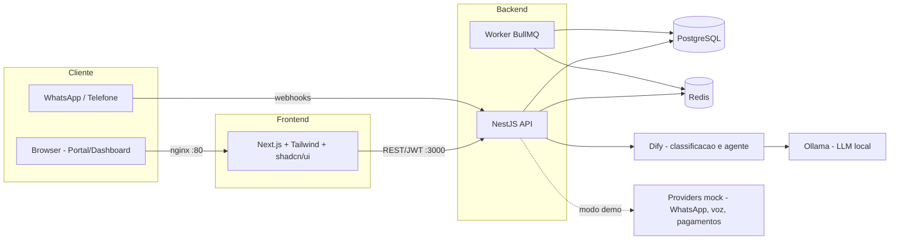

# Architecture

## Overview

Monorepo with two apps (API + Web) and a shared types package, managed by Turborepo.

## API Design

- RESTful, versioned (`/api/v1/`)
- JWT auth with refresh tokens
- Multi-tenant via `organizationId` on every entity
- RBAC with 6 roles
- Exception filters for structured error responses
- Audit logging for sensitive operations

## Modules

| Module | Description |
|--------|-------------|
| `Auth` | JWT + refresh, login, register |
| `Users` | User CRUD, RBAC |
| `Organizations` | Tenant management |
| `Crm` | Leads, customers, conversion |
| `Appointments` | Scheduling |
| `Checkins` | Check-in surveys + risk scoring |
| `Activity` | Activity logging |
| `Automation` | Event-driven workflows |
| `Messages` | WhatsApp mock channel |
| `Calls` | AI voice mock channel |
| `Reports` | Dashboards |
| `Clients` | Client-specific profiles |
| `Config` | Environment config |

## Data Flow

1. Web → REST API (JSON)
2. API validates JWT + permissions + tenant
3. Business logic layer
4. Prisma ORM → PostgreSQL
5. Response serialized (strips sensitive fields)

## Automation Engine

Event → Publisher → WorkflowMatcher → ConditionEvaluator → ActionExecutor → Audit

Events are published in-process. Webhook actions are fire-and-forget.

## Risk Scoring

Deterministic weighted model based on self-reported check-in data.
Non-clinical: outputs are operational signals requiring human review.
